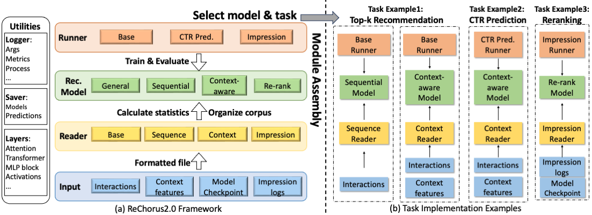

# LightGCL--ReChorus

### SYSU-人工智能学院-机器学习大作业
#### 项目介绍
- 利用推荐系统为背景，采用[ReChorus2.0框架](https://github.com/THUwangcy/ReChorus)，对[LightGCL](https://github.com/HKUDS/LightGCL)推荐模型进行复现，并与框架中同类别算法（不少于2个），在框架提供的数据集上（不少于2个），进行实验结果对比分析

#### 代码位置
- LightGCL模型:`src/general/LightGCL.py`

#### 模型运行
- **Efficient**: multi-thread batch preparation, special implementations for the evaluation, and around 90% GPU utilization during training for deep models.

#### 实验结果
- **Flexible**: implement new readers or runners for different datasets and experimental settings, and each model can be assigned with specific helpers.

## Structure

Generally, ReChorus decomposes the whole process into three modules:

- [Reader](https://github.com/THUwangcy/ReChorus/tree/master/src/helpers/BaseReader.py): read dataset into DataFrame and append necessary information to each instance
- [Runner](https://github.com/THUwangcy/ReChorus/tree/master/src/helpers/BaseRunner.py): control the training process and model evaluation, including evaluation metrics.
- [Model](https://github.com/THUwangcy/ReChorus/tree/master/src/models/BaseModel.py): define how to generate output (predicted labels or ranking scores) and prepare batches.



## Requirements & Getting Started
See in the doc for [Requirements & Getting Started](https://github.com/THUwangcy/ReChorus/tree/master/docs/Getting_Started.md).

## Tasks & Settings

The tasks & settings are listed below

<table>
<tr><th> Tasks </th><th> Runner </th><th> Metrics </th><th> Loss Functions</th><th> Reader </th><th> BaseModel </th><th> Models</th><th> Model Modes </th></tr>
<tr><td rowspan="3"> Top-k Recommendation </td><td rowspan="3"> BaseRunner </td><td rowspan="3"> HitRate NDCG </td><td rowspan="3"> BPR </td><td> BaseReader </td><td> BaseModel.GeneralModel </td><td> general </td><td> '' </td></tr>
<tr><td> SeqReader </td><td> BaseModel.SequentialModel </td><td> sequential </td><td> '' </td></tr>
<tr><td> ContextReader </td><td> BaseContextModel.ContextModel </td><td> context </td><td> 'TopK' </td></tr>
<tr><td> CTR Prediction </td><td> CTRRunner </td><td> AUC Logloss </td><td> BPR, BCE </td><td> ContextReader </td><td> BaseContextModel.ContextCTRModel </td><td> context </td><td> 'CTR' </td></tr>
<tr><td rowspan="4"> Impression-based Ranking </td><td rowspan="4"> ImpressionRunner </td><td rowspan="4"> HitRate NDCG MAP </td><td rowspan="4"> List-level BPR, Listnet loss, Softmax cross entropy loss, Attention rank </td><td> ImpressionReader </td><td> BaseImpressionModel.ImpressionModel </td><td> general </td><td> 'Impression' </td></tr>
<tr><td> ImpressionSeqReader </td><td> BaseImpressionModel.ImpressionSeqModel </td><td> sequential </td><td> 'Impression' </td></tr>
<tr><td> ImpressionReader </td><td> BaseRerankerModel.RerankModel </td><td> reranker </td><td> 'General' </td></tr>
<tr><td> ImpressionSeqReader </td><td> BaseRerankerModel.RerankSeqModel </td><td> reranker </td><td> 'Sequential' </td></tr>
</table>


## Arguments
See in the doc for [Main Arguments](https://github.com/THUwangcy/ReChorus/tree/master/docs/Main_Arguments.md).

## Models
See in the doc for [Supported Models](https://github.com/THUwangcy/ReChorus/tree/master/docs/Supported_Models.md).

Experimental results and corresponding configurations are shown in [Demo Script Results](https://github.com/THUwangcy/ReChorus/tree/master/docs/demo_scripts_results/README.md).


## Citation

**If you find ReChorus is helpful to your research, please cite either of the following papers. Thanks!**

```
@article{li2024rechorus2,
  title={ReChorus2. 0: A Modular and Task-Flexible Recommendation Library},
  author={Li, Jiayu and Li, Hanyu and He, Zhiyu and Ma, Weizhi and Sun, Peijie and Zhang, Min and Ma, Shaoping},
  journal={arXiv preprint arXiv:2405.18058},
  year={2024}
}

@inproceedings{wang2020make,
  title={Make it a chorus: knowledge-and time-aware item modeling for sequential recommendation},
  author={Wang, Chenyang and Zhang, Min and Ma, Weizhi and Liu, Yiqun and Ma, Shaoping},
  booktitle={Proceedings of the 43rd International ACM SIGIR Conference on Research and Development in Information Retrieval},
  pages={109--118},
  year={2020}
}
@article{王晨阳2021rechorus,
  title={ReChorus: 一个综合, 高效, 易扩展的轻量级推荐算法框架},
  author={王晨阳 and 任一 and 马为之 and 张敏 and 刘奕群 and 马少平},
  journal={软件学报},
  volume={33},
  number={4},
  pages={0--0},
  year={2021}
}
```

This is also our public implementation for the following papers (codes and datasets to reproduce the results can be found at corresponding branch):


- *Chenyang Wang, Min Zhang, Weizhi Ma, Yiqun Liu, and Shaoping Ma. [Make It a Chorus: Knowledge- and Time-aware Item Modeling for Sequential Recommendation](http://www.thuir.cn/group/~mzhang/publications/SIGIR2020Wangcy.pdf). In SIGIR'20.*

```bash
git clone -b SIGIR20 https://github.com/THUwangcy/ReChorus.git
```

- *Chenyang Wang, Weizhi Ma, Min Zhang, Chong Chen, Yiqun Liu, and Shaoping Ma. [Towards Dynamic User Intention: Temporal Evolutionary Effects of Item Relations in Sequential Recommendation](https://chenchongthu.github.io/files/TOIS-KDA-wcy.pdf). In TOIS'21.*

```bash
git clone -b TOIS21 https://github.com/THUwangcy/ReChorus.git
```

- *Chenyang Wang, Weizhi Ma, Chong, Chen, Min Zhang, Yiqun Liu, and Shaoping Ma. [Sequential Recommendation with Multiple Contrast Signals](https://dl.acm.org/doi/pdf/10.1145/3522673). In TOIS'22.*

```bash
git clone -b TOIS22 https://github.com/THUwangcy/ReChorus.git
```

- *Chenyang Wang, Zhefan Wang, Yankai Liu, Yang Ge, Weizhi Ma, Min Zhang, Yiqun Liu, Junlan Feng, Chao Deng, and Shaoping Ma. [Target Interest Distillation for Multi-Interest Recommendation](). In CIKM'22.*

```bash
git clone -b CIKM22 https://github.com/THUwangcy/ReChorus.git
```

## Contact

**ReChorus 1.0**: Chenyang Wang (THUwangcy@gmail.com)

**ReChorus 2.0**: Jiayu Li (lijiayu997@gmail.com), Hanyu Li (l-hy12@outlook.com)

<!-- MARKDOWN LINKS & IMAGES -->

<!-- https://www.markdownguide.org/basic-syntax/#reference-style-links -->

[contributors-shield]: https://img.shields.io/github/contributors/othneildrew/Best-README-Template.svg?style=flat-square
[contributors-url]: https://github.com/othneildrew/Best-README-Template/graphs/contributors
[forks-shield]: https://img.shields.io/github/forks/othneildrew/Best-README-Template.svg?style=flat-square
[forks-url]: https://github.com/othneildrew/Best-README-Template/network/members
[stars-shield]: https://img.shields.io/github/stars/othneildrew/Best-README-Template.svg?style=flat-square
[stars-url]: https://github.com/othneildrew/Best-README-Template/stargazers
[issues-shield]: https://img.shields.io/github/issues/othneildrew/Best-README-Template.svg?style=flat-square
[issues-url]: https://github.com/othneildrew/Best-README-Template/issues
[license-shield]: https://img.shields.io/github/license/othneildrew/Best-README-Template.svg?style=flat-square
[license-url]: https://github.com/othneildrew/Best-README-Template/blob/master/LICENSE.txt
[linkedin-shield]: https://img.shields.io/badge/-LinkedIn-black.svg?style=flat-square&logo=linkedin&colorB=555
[linkedin-url]: https://linkedin.com/in/othneildrew
[product-screenshot]: images/screenshot.png
