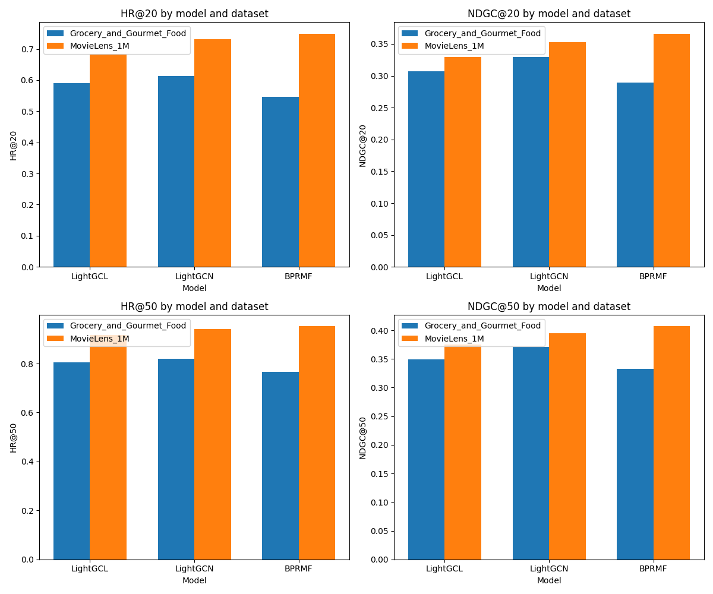

# LightGCL--ReChorus

### SYSU-人工智能学院-机器学习大作业
#### 项目介绍
- 利用推荐系统为背景，采用[ReChorus2.0框架](https://github.com/THUwangcy/ReChorus)，对[LightGCL](https://github.com/HKUDS/LightGCL)推荐模型进行复现，并与框架中同类别算法（不少于2个），在框架提供的数据集上（不少于2个），进行实验结果对比分析

#### 代码位置
- LightGCL模型:`src/general/LightGCL.py`

#### 模型运行
1. 使用Python安装[Anaconda](https://docs.conda.io/en/latest/miniconda.html) >= 3.10
2. 克隆存储库

```bash
git clone https://github.com/THUwangcy/ReChorus.git
```

3. 环境配置

```bash
cd ReChorus
pip install -r requirements.txt
```

4. 使用内置数据集运行模型

- **Grocery_and_Gourmet_Food数据集**
```bash
python src\main.py --model_name LightGCL --emb_size 32 --lr 1e-3 --l2 1e-6 --dataset Grocery_and_Gourmet_Food
```
- **MovieLens_1M数据集**
```bash
python src\main.py --model_name LightGCL --emb_size 32 --lr 1e-3 --l2 1e-6 --dataset MovieLens_1M\ML_1MTOPK
```

5. （可选）运行数据集文件夹中`.ipynb`文件以下载和构建新的数据集，或根据`data`中的[指南](https://github.com/Hjq-666/LightGCL-ReChorus/blob/main/data/README.md)去准备自己的数据集

#### 实验结果
- 我们采用了框架中三种不同的模型在[Grocery_and_Gourmet_Food](https://www.kaggle.com/datasets/shuyangli94/food-com-recipes-and-user-interactions)数据集和[MovieLens_1M](https://grouplens.org/datasets/movielens/1m/)数据集上进行了对比实验，实验结果如下：
  
| dataset                      | model    | HR@20 | NDGC@20 | HR@50 | NDGC@50 |
|------------------------------|----------|-------|---------|-------|---------|
| Grocery_and_Gourmet_Food     | LightGCL | 0.5897| 0.3070  | 0.8062| 0.3497  |
|                              | LightGCN | 0.6125| 0.3298  | 0.8189| 0.3706  |
|                              | BPRMF    | 0.5463| 0.2895  | 0.7664| 0.3329  |
| MovieLens_1M                 | LightGCL | 0.6844| 0.3293  | 0.9161| 0.3756  |
|                              | LightGCN | 0.7310| 0.3528  | 0.9412| 0.3951  |
|                              | BPRMF    | 0.7488| 0.3659  | 0.9520| 0.4068  |




